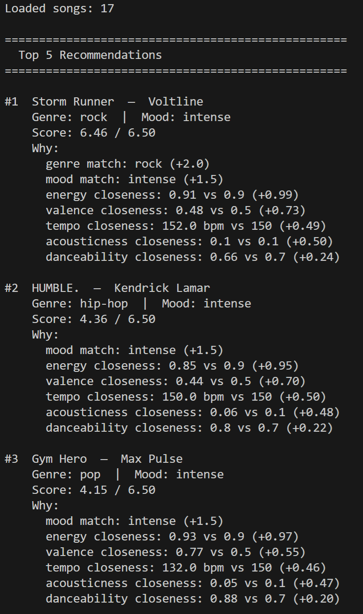
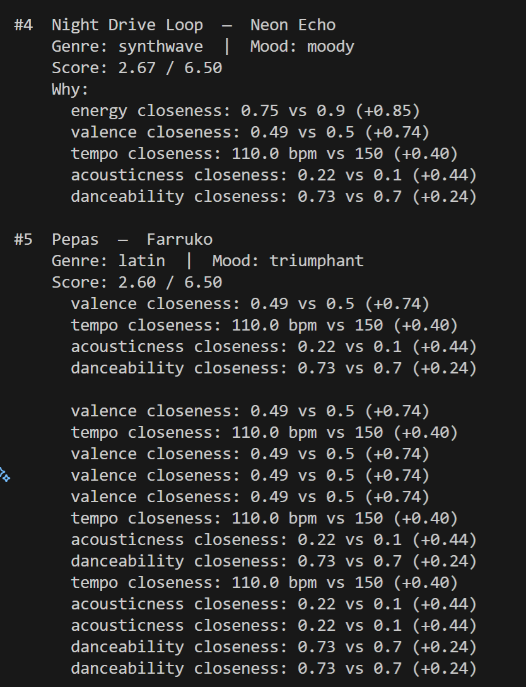
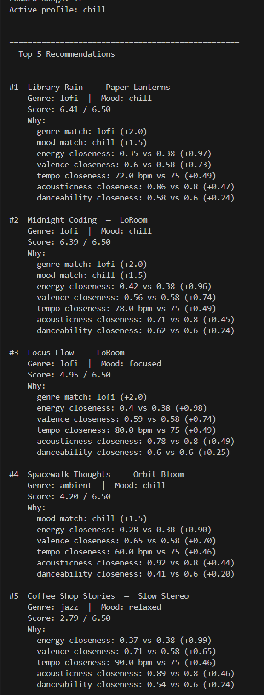
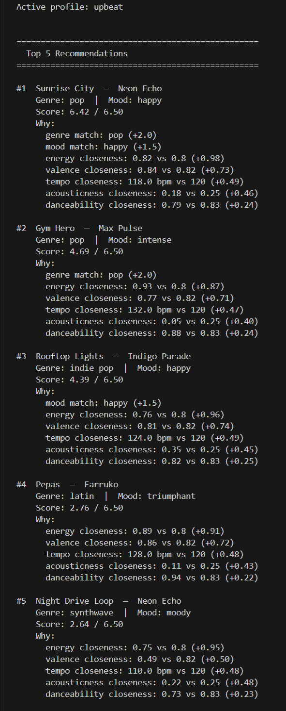
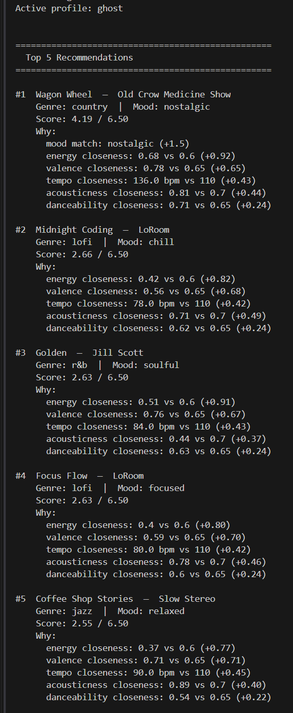
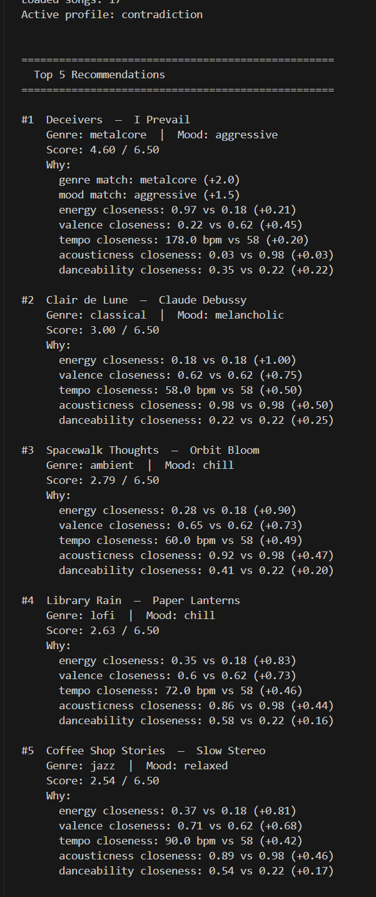
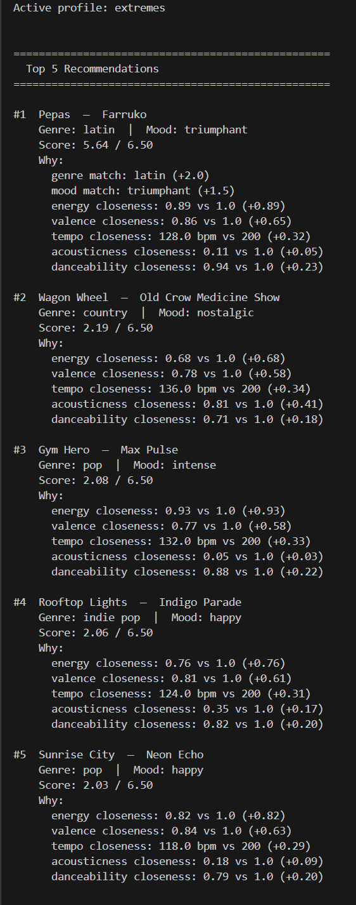

# 🎵 Music Recommender Simulation

## Project Summary

VibeMatch 1.0 is a content-based music recommender that scores every song in a 17-song catalog against a user's taste profile and returns the top 5 matches. Each song is scored using seven weighted signals — genre match, mood match, energy closeness, valence closeness, tempo closeness, acousticness closeness, and danceability closeness — for a maximum of 6.50 points. Every recommendation prints a breakdown of exactly why that song scored the way it did. Six user profiles were tested, including three adversarial edge cases designed to expose weaknesses in the scoring logic.

---

## How The System Works

Real-world recommenders like Spotify and YouTube combine two strategies: collaborative filtering, which surfaces songs that users with similar taste enjoyed, and content-based filtering, which matches songs based on their audio attributes like energy, mood, and tempo. At scale, these systems layer in contextual signals (time of day, device, recent skips) and use machine learning to continuously re-weight what matters most for each user. This version prioritizes content-based filtering — it scores each song by comparing its attributes to a user's stated preferences, rewards closeness rather than magnitude, and ranks the full catalog to return the best matches. The goal is transparency: every recommendation can be traced back to a specific feature comparison, making it easy to understand why a song was suggested and where the system falls short.

### Song Features

Each `Song` stores: `id`, `title`, `artist`, `genre`, `mood`, `energy`, `tempo_bpm`, `valence`, `danceability`, `acousticness`.

### User Profile Fields

Each `UserProfile` stores: `favorite_genre`, `favorite_mood`, `target_energy`, `target_valence`, `target_tempo_bpm`, `target_danceability`, `target_acousticness`, `likes_acoustic`.

### Algorithm Recipe

Every song in the catalog is scored against the user profile using these rules:

| Rule | Points |
|---|---|
| Genre exact match | +2.0 |
| Mood exact match | +1.5 |
| Energy closeness: `1 − │song − target│ × 1.0` | 0.0 – 1.00 |
| Valence closeness `× 0.75` | 0.0 – 0.75 |
| Tempo closeness (normalized ÷ 200) `× 0.50` | 0.0 – 0.50 |
| Acousticness closeness `× 0.50` | 0.0 – 0.50 |
| Danceability closeness `× 0.25` | 0.0 – 0.25 |
| **Maximum possible score** | **6.50** |

All songs are then sorted by score (descending) and the top `k` are returned.

### Data Flow

```
songs.csv ──▶ load_songs ──▶ score every song (loop) ──▶ sort descending ──▶ top K results
                               ▲
                          user_prefs dict
```

### Expected Biases

- **Genre dominance:** At +2.0, a genre match outweighs all numeric signals combined in many cases. A song with a perfect energy, valence, and tempo match but a different genre will still lose to a mediocre same-genre song. This could bury cross-genre gems (e.g., a folk track that feels exactly like the user's target energy).
- **Mood as a hard filter:** Mood is binary — no partial credit for adjacent moods like *focused* vs. *chill*. A focused listener will score *chill* songs the same as *aggressive* ones, even though focused and chill are far closer in spirit.
- **Cold start gap:** The profile requires explicit target values for every feature. A real user who just says "I like Mumford & Sons" would need those values inferred — this system has no mechanism for that.
- **Catalog skew:** The dataset of 17 songs has 3 lofi tracks but only 1 classical and 1 latin track. Genre-matched recommendations will be richer for lofi listeners than for latin listeners, purely due to catalog size.

---

## Getting Started

### Setup

1. Create a virtual environment (optional but recommended):

   ```bash
   python -m venv .venv
   source .venv/bin/activate      # Mac or Linux
   .venv\Scripts\activate         # Windows

2. Install dependencies

```bash
pip install -r requirements.txt
```

3. Run the app:

```bash
python -m src.main
```

### Running Tests

Run the starter tests with:

```bash
pytest
```

You can add more tests in `tests/test_recommender.py`.

---

## Experiments You Tried

- **Reduced genre weight from +2.0 to +1.0, doubled energy weight from ×1.0 to ×2.0** — the max score stayed at 6.50 but the field became more competitive. Songs with similar energy but different genres moved closer to the top, and the gap between #1 and #2 shrank noticeably for the intense profile.

- **Added an acoustic mismatch penalty (−1.0)** — triggered only when `likes_acoustic: True` and `acousticness < 0.3`. This was added after the extremes profile kept ranking Pepas (acousticness 0.11) at #1 despite the user explicitly requesting acoustic music. The penalty dropped Pepas by 1.0 point and surfaced Wagon Wheel and Little Lion Man instead, without affecting any non-acoustic profiles.

- **Tested the contradiction profile** — numeric targets pointing at Clair de Lune (low energy, slow tempo, high acousticness) but genre/mood labels pointing at metalcore. Genre dominance still won: Deceivers ranked higher than Clair de Lune because the genre label matched, even though the actual sound was the opposite of the user's targets. This confirmed the genre weight is still too strong relative to audio features.

- **Tested the ghost profile** — genre and mood set to values that don't exist in the catalog (bluegrass, nostalgic). The system scored every song at 0 on categorical signals and ranked entirely by numeric closeness. The results felt coherent — songs with similar energy and acousticness grouped together — showing the numeric signals alone are meaningful.

---

## Limitations and Risks

- **Genre still dominates** — even after reducing the genre bonus to +1.0, a genre match can outweigh near-perfect audio alignment. A song with the right label but the wrong sound will still beat a song that fits the user's numeric preferences exactly.
- **No contradiction detection** — the system cannot flag when a user's preferences are self-contradictory (e.g., maximum energy + maximum acousticness), so it silently returns poor results instead of warning the user.
- **Catalog is too small** — 17 songs cannot serve all listener types fairly. Genres with only one song (classical, latin, metalcore) will produce repetitive or thin recommendations.
- **No learning from feedback** — the system has no memory. Skips, replays, and listening history are completely ignored, so preferences never improve over time.
- **Mood matching is binary** — adjacent moods like *focused* and *chill* are treated as completely unrelated, same as *focused* and *aggressive*, even though some moods are clearly closer in spirit than others.

---

## Reflection

Read and complete `model_card.md`:

[**Model Card**](model_card.md)

Building this system made it clear that a recommender is only as good as its assumptions about what matters. Every weight is a design decision, and every design decision has tradeoffs.

**intense vs. chill** — These two profiles produced the most opposite results in the catalog. Intense surfaced Storm Runner, HUMBLE., and Gym Hero — all high-energy, low-acousticness tracks. Chill surfaced Library Rain, Focus Flow, and Midnight Coding — slow, warm, acoustic. The separation made sense because energy and acousticness are the strongest numeric signals, and these two profiles sit at opposite ends of both. What was interesting is that the gap between #1 and #2 was much larger for intense (6.46 vs 4.36) than for chill, because there are three lofi songs in the catalog that all cluster tightly — the chill profile had real competition within its genre.

**intense vs. contradiction** — The contradiction profile had numeric targets that pointed directly at Clair de Lune (low energy, slow tempo, high acousticness) but genre/mood labels pointing at metalcore. Intense had both labels and numbers aligned. The difference in output exposed the core bias: genre match awarded +1.0 regardless of how far the actual sound diverged from the user's numeric targets. A song could score well just by having the right label, even when everything else about it contradicted the user's stated preferences. Real recommenders solve this by learning label-to-audio relationships from millions of users rather than trusting genre tags directly.

**ghost vs. extremes** — Both profiles got zero points on categorical signals, but for different reasons. Ghost had genres and moods that don't exist in the catalog — the system had no choice but to rank by audio features alone, and the results felt surprisingly coherent. Extremes set every numeric target to maximum, which created an impossible request — no song can be maximally energetic and maximally acoustic at the same time. Ghost showed the system works gracefully without labels. Extremes showed it has no way to detect or warn about contradictory input, which is the kind of edge case a production system would need to handle explicitly.


---

## Screenshots

### intense profile (default)



### other profiles




